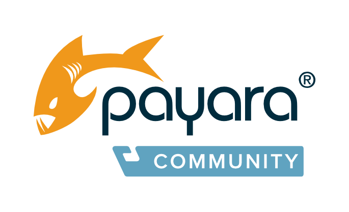

## About Payara

The [Payara Foundation](http://www.payara.org) is a non-profit foundation whose mission is to ensure the continued development and maintenance of Payara Server and Payara Micro as open source software for the benefit of its community of users.

***Payara Server*** is a patched, enhanced, and supported application server derived from GlassFish Server Open Source Edition, beginning from GlassFish version 4.1.  
***Payara Micro*** is a new distribution, initially built from the Payara Server Embedded Web release and since enhanced with many new features to focus on cloud-native, elastically scalable environments. Payara Micro features automatic, dynamic clustering powered by Hazelcast.

Visit [payara.fish](https://www.payara.fish) for full 24/7 support and lots of free resources.

Information about the Open Source project is on the [GitHub project page](http://www.payara.org).

**Full Payara Server and Payara Micro documentation can be found at [docs.payara.fish](https://docs.payara.fish)**

Payara Server is a drop in replacement for GlassFish Server Open Source with the peace of mind of quarterly releases containing enhancements, bug fixes and patches including patches to dependent libraries, as required, including Tyrus, Eclipse Link, Jersey and others. Our vision is to optimise Payara Server and make it the best server for production Java applications with responsive 24/7 dedicated incident and software support from the best middleware engineers in the industry. Payara Server continues to draw fixes and features from upstream GlassFish in addition to fixes written by Payara developers. Additional features are also added, such as JCache support through Hazelcast and support for Eclipse MicroProfile.

We have added full JCache support, enhanced JBatch functionality, replaced Shoal with Hazelcast for session clustering, and are driving development of Payara Micro; a completely new way of running WAR applications on top of an embedded Payara Server core, Payara Micro is ideally suited to cloud and microservice architectures with elastic clustering and no installation. Payara Micro can run WAR applications simply using:

```
java -jar payara-micro.jar --deploy test.war
```

In summary, Payara Server provides:

* Fully supported server derived from GlassFish 4.x Open Source Edition
* Drop-in replacement for GlassFish Open Source Edition
* Production enhancements including JCache, JBatch, and Hazelcast session clustering.
* Payara Micro for cloud and microservice deployments
* Always open source dual licensed CDDL/GPL
* Supported by dedicated engineers 24/7
* Incident and software support
* Optimised for production and operations
* Quarterly patch releases and bug fixes
* Stability Stream releases, including only fixes, available for support customers

## Supported JDKs and Operating Systems

Payara Server currently supports the following JDKs:

* Oracle JDK 7/8
* Azul Zulu 7/8
* OpenJDK 7/8
* IBM J9 7/8

Payara Server currently supports the following operating systems:

* Windows 7+
* Windows Server 2008+
* Ubuntu 14.04 LTS (Trusty Tahr)+
* Debian 7 (Wheezy)+
* CentOS 6+
* RHEL 5+
* OpenSUSE 42.2+
* SUSE 11.4 & 12.2+
* AIX 7.3 TL3+
* macOS(OSX) 10.10.5 (Yosemite)+

## Tested Platforms

While not all environments are tested, if it is on a supported JVM we will provide support for customers and address issues reported by the community. Other platforms can always be supported in the future.

Payara Server is currently tested on the following platforms:

|                       |Oracle JDK     |Azul Zulu      |OpenJDK        |IBM J9 |
|---                    |---            |---            |---            |---    |
|Windows 7              |✓              |               |               |       |
|Windows 10             |✓              |               |               |       |
|Windows Server 2016    |✓              |               |               |       |
|Ubuntu 16.04, 17.04    |✓              |✓              |✓              |✓      |
|Debian 8               |✓              |               |               |       |
|CentOS 7               |✓              |               |               |       |
|OpenSUSE 42.2          |✓              |               |               |       |
|AIX 7.3 TL3            |               |               |               |✓       |
|macOS      10.12.5     |✓              |               |               |       |

GlassFish is a trademark of Oracle Corporation.  
Payara is a trademark of Payara Foundation.
